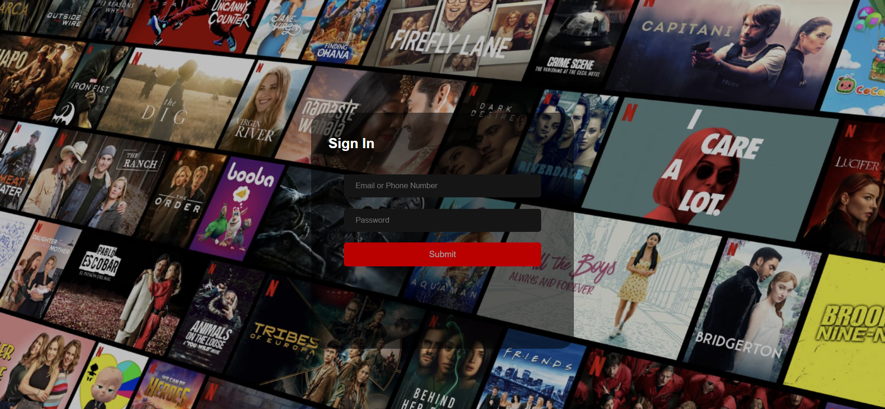
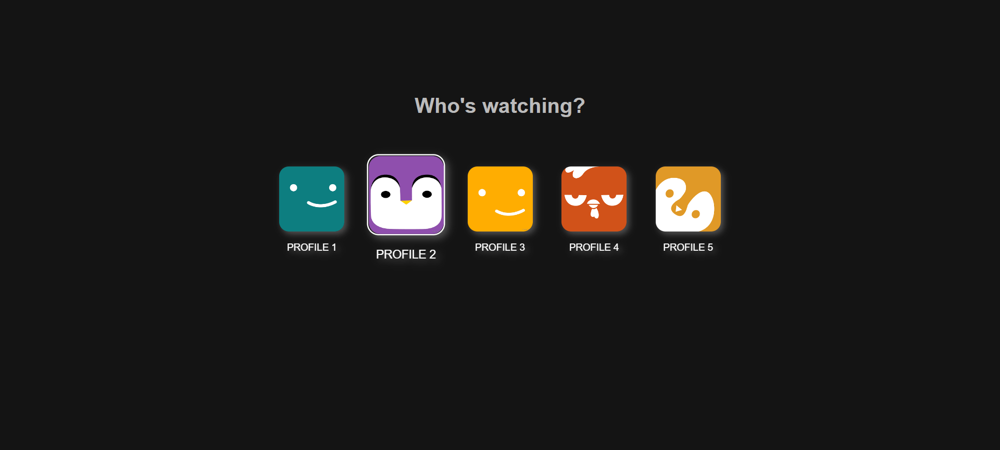
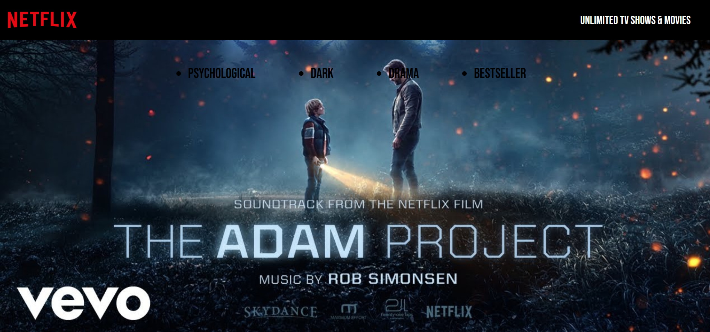

# Netflix-Clone

A Basic Replication of Netflix Platform

This project is a web-based application that replicates the basic features and design of Netflix using HTML, CSS, and JavaScript. The project aims to provide a responsive and interactive user interface.

Here's a live deployment - https://amritha-07.github.io/Netflix-Clone/

<center>
    
</center>

<center>
    
</center>

<center>
    
</center>

## Tech-Stack

- HTML
- CSS
- JavaScript

## Features

- The application mimics the layout and style of Netflix, with a dark theme, a logo, a navigation bar, and a footer.
- The application has a profile page that let's you hover over the profile pictures.

## Installation and Usage

To install and run this project, you need to have a web browser (such as Chrome or Firefox) that supports HTML, CSS, and JavaScript.

To download the code and assets for this project, you can clone this GitHub repository using the following command:

```git clone https://github.com/Amritha-07/Netflix-Clone.git```